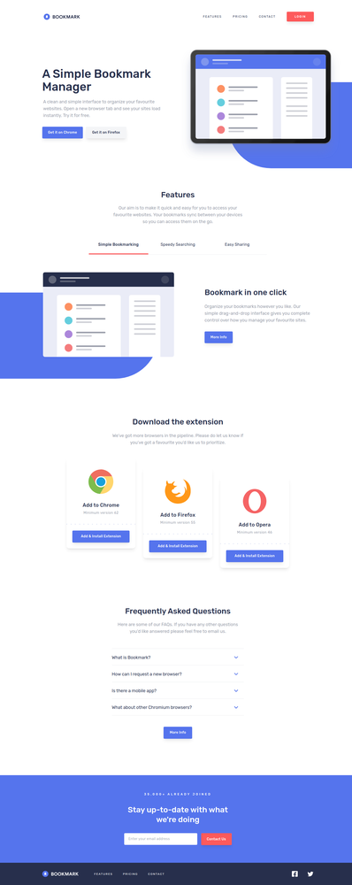

# Frontend Mentor - Bookmark landing page solution

This is a solution to the [Bookmark landing page challenge on Frontend Mentor](https://www.frontendmentor.io/challenges/bookmark-landing-page-5d0b588a9edda32581d29158). Frontend Mentor challenges help you improve your coding skills by building realistic projects.

## Table of contents

- [Overview](#overview)
  - [The challenge](#the-challenge)
  - [Screenshots](#screenshots)
  - [Links](#links)
- [My process](#my-process)
  - [Built with](#built-with)
  - [What I learned](#what-i-learned)

## Overview

### The challenge

Users should be able to:

- View the optimal layout for the site depending on their device's screen size
- See hover states for all interactive elements on the page
- Receive an error message when the newsletter form is submitted if:
  - The input field is empty
  - The email address is not formatted correctly

### Screenshots

Click to open the full-size screenshot.

| Mobile layout                                                                       | Desktop layout                                                                        |
| ----------------------------------------------------------------------------------- | ------------------------------------------------------------------------------------- |
| <a href="./screenshots/mobile.png"></a> | <a href="./screenshots/desktop.png"></a> |

### Links

- Solution URL: [https://www.frontendmentor.io/solutions/bookmark-landing-page-with-remix-and-tailwind-KKZkpxv7RR](https://www.frontendmentor.io/solutions/bookmark-landing-page-with-remix-and-tailwind-KKZkpxv7RR)
- Live Site URL: [https://kt-frontend-mentor-bookmark-landing-page.netlify.app/](https://kt-frontend-mentor-bookmark-landing-page.netlify.app/)

## My process

### Built with

- Semantic HTML5 markup
- Flexbox
- CSS Grid
- Mobile-first workflow
- [React](https://reactjs.org/) - JS library
- [Remix](https://remix.run/) - React framework
- [Tailwind CSS](https://tailwindcss.com/) - CSS framework

### What I learned

#### Dynamically sized accordion items

At first I've implemented the accordion's opening and closing animations by toggling between `0` and fixed value `max-height` like `10rem`. But this approach has the following issues:

- Animations are not consistent between items of different sizes. Since the transitions are between 0 and a fixed value, not the actual height of the content.
- Setting a low `max-height` has the chance of cutting out part of the content. And setting it too high makes the animations too quick.

Doing some research on other methods, found this [Codepen by Aaron Bushnell](https://codepen.io/aaronbushnell/pen/eGVdzv), where he showcases a way to get the appropriate `max-height` value for each item with vanilla JS.

Based on his approach I came up with this solution on React:

```tsx
function AccordionItem({ open, title, text, onClick }: Props) {
  // Will hold the max-height for this item, the negative value means that it
  // is not initialized and we need to measure it
  const [maxHeight, setMaxHeight] = useState(-1)
  const container = useRef<HTMLDivElement>(null)

  useEffect(() => {
    // We use the scrollHeight value of container as the max-height, but this
    // requires it to actually be rendered. Which is why we set it to be
    // absolute positioned and invisible at first, to allow measuring
    if (maxHeight < 0) setMaxHeight(answerContainer.current?.scrollHeight ?? 0)
  }, [maxHeight])

  useEffect(() => {
    // In the event where the user decides to resize the screen, the content's
    // dimensions might change, so we need to measure a new max-height, we do
    // this by setting maxHeight to a negative value, thus triggering the
    // effect above
    const onResize = () => setMaxHeight(-1)

    window.addEventListener('resize', onResize)

    return () => window.removeEventListener('resize', onResize)
  }, [])

  return (
    <div>
      <button onClick={onClick}>{title}</button>
      <div
        ref={container}
        style={{ maxHeight: maxHeight < 0 ? undefined : open ? maxHeight : 0 }}
        className={clsx(
          'overflow-hidden transition-[max-height] duration-300 ease-in-out',
          {
            'invisible absolute': maxHeight < 0,
          }
        )}
      >
        <p>{text}</p>
      </div>
    </div>
  )
}
```
